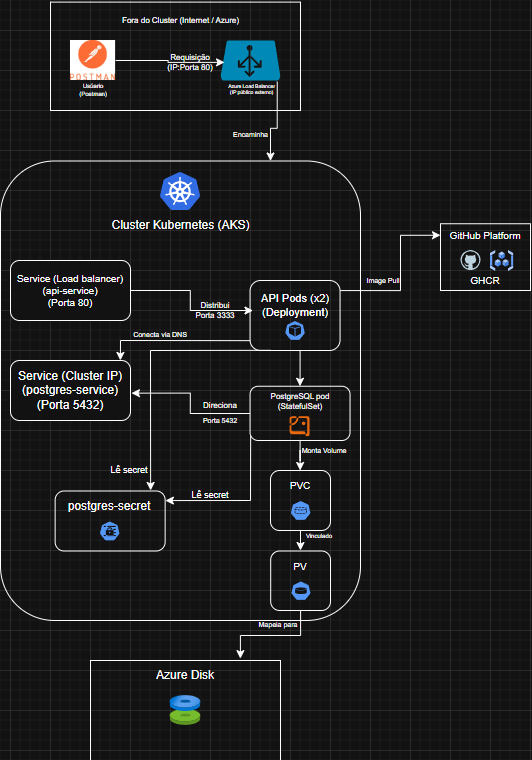

# Projeto 2: API de Tarefas com PostgreSQL no Azure Kubernetes Service (AKS)

[CI - Build and Push API Image](https://github.com/Gravity22222/ToDoList-backend-NodeJS/actions/workflows/ci-pipeline.yml)

[Release Please](https://github.com/Gravity22222/ToDoList-backend-NodeJS/actions/workflows/release-please.yml)

 Este projeto demonstra a implantação de uma aplicação web de duas camadas (API RESTful Node.js + Banco de Dados PostgreSQL) em um ambiente de orquestração de contêineres utilizando o Azure Kubernetes Service (AKS). A infraestrutura é provisionada via Terraform e a aplicação é definida e gerenciada através de manifestos declarativos do Kubernetes. O pipeline de CI/CD para a imagem da API é automatizado com GitHub Actions.

## 🏛️ Arquitetura Kubernetes


 .

**Fluxo Simplificado:**
1.  **CI/CD:** Código da API enviado ao GitHub -> GitHub Actions constrói a imagem Docker -> Imagem enviada ao GHCR.
2.  **IaC:** Terraform provisiona o cluster AKS na Azure (usando `local-exec` para contornar limitações do provedor com contas Free Tier).
3.  **Deploy Kubernetes:** Manifestos YAML são aplicados via `kubectl`:
    * `Secret` para senha do DB.
    * `StatefulSet` para o PostgreSQL com `PersistentVolumeClaim` (PVC) para dados persistentes em Azure Disk.
    * `Service (ClusterIP)` para acesso interno ao DB.
    * `Deployment` para a API Node.js (lendo config do DB via env vars/Secret).
    * `Service (LoadBalancer)` para expor a API externamente via Azure Load Balancer.
4.  **Acesso:** Usuário interage com a API através do IP público do Load Balancer.

## 🛠️ Tecnologias Utilizadas

* **Orquestração:**  (AKS - Azure Kubernetes Service)
* **Containerização:** 
* **Infraestrutura como Código:** 
* **Nuvem:** 
* **CI/CD:** , GHCR, Release Please
* **Aplicação:** , Express, Sequelize
* **Banco de Dados:** 
* **Ferramentas:** `kubectl`, Azure CLI

## 📂 Estrutura do Repositório (Monorepo)

* `README.md`: Este arquivo.
* `application/`: Código-fonte da API Node.js, `Dockerfile`, configurações (`.sequelizerc`, `database.cjs`, `auth.cjs`), arquivos de migração (`.cjs`), e workflows de CI/CD (`.github/workflows/`).
* `infrastructure/`: Código Terraform (`main.tf`) para provisionar o cluster AKS na Azure.
* `kubernetes/`: Manifestos Kubernetes (`.yaml`) para implantar a API e o PostgreSQL no cluster.
* `docs/`: Documentação adicional e imagens (como o diagrama de arquitetura).

## 🚀 Como Executar

### Pré-requisitos
* Conta no GitHub
* Conta na Microsoft Azure (com provedores `Microsoft.ContainerService`, `Microsoft.OperationalInsights`, `Microsoft.OperationsManagement` registrados)
* [Terraform](https://developer.hashicorp.com/terraform/downloads) >= v1.0
* [Azure CLI](https://learn.microsoft.com/pt-br/cli/azure/install-azure-cli) autenticada (`az login`)
* [kubectl](https://kubernetes.io/docs/tasks/tools/install-kubectl/)
* Git

### Passo 1: Construir a Imagem da API (CI/CD)
* Faça um fork deste repositório.
* Clone o seu fork.
* O pipeline de GitHub Actions na pasta `application/.github/workflows/` será acionado em cada `push` para a branch `main`. Ele construirá a imagem Docker da API e a publicará no seu GitHub Container Registry (GHCR).
* **Importante:** Verifique se as permissões do seu repositório/conta permitem que o Actions escreva pacotes (Settings > Actions > General > Workflow Permissions -> Read and write).
* **Anote o caminho completo da sua imagem publicada** (ex: `ghcr.io/seu-usuario/devops-portfolio-project-2/application:main`).

### Passo 2: Provisionar a Infraestrutura (Terraform + AKS)
1.  Navegue até a pasta de infraestrutura: `cd infrastructure`
2.  Inicialize o Terraform: `terraform init`
3.  Aplique a configuração (pode levar 10-15 minutos): `terraform apply` (Confirme com `yes`).
    * *Nota:* Este Terraform usa `local-exec` com a Azure CLI para criar o cluster AKS, contornando um bug do provedor `azurerm` com contas Free Tier que bloqueiam APIs "preview".
4.  Configure o `kubectl` para conectar ao novo cluster:
    ```bash
    az aks get-credentials --resource-group $(terraform output -raw resource_group_name) --name $(terraform output -raw cluster_name)
    ```
5.  Verifique a conexão: `kubectl get nodes` (Deve mostrar 1 nó `Ready`).

### Passo 3: Implantar a Aplicação no Kubernetes (Manifestos YAML)
1.  Navegue até a pasta dos manifestos: `cd ../kubernetes`
2.  **Crie o Secret do Banco:**
    * Escolha uma senha para o PostgreSQL.
    * Gere a versão Base64 dela:
        * Linux/Mac/Git Bash: `echo -n 'SUA_SENHA' | base64`
        * PowerShell: `[Convert]::ToBase64String([System.Text.Encoding]::UTF8.GetBytes('SUA_SENHA'))`
    * Edite o arquivo `postgres-secret.yaml` e cole a string Base64 no campo `POSTGRES_PASSWORD`.
    * Aplique o secret: `kubectl apply -f postgres-secret.yaml`
3.  **Edite o Deployment da API:**
    * Abra o arquivo `api-deployment.yaml`.
    * Encontre as **duas** ocorrências de `image:` e substitua o placeholder `ghcr.io/SEU_USUARIO/SEU_REPO_API:TAG` pelo caminho completo da sua imagem que o CI/CD publicou no Passo 1.
4.  **Aplique os Manifestos Restantes (na ordem):**
    ```bash
    # Opcional, pois o StatefulSet criará o PVC automaticamente, mas bom para garantir:
    # kubectl apply -f postgres-pvc.yaml 
    
    # Cria o PostgreSQL (StatefulSet + PVC automático + Pod)
    kubectl apply -f postgres-statefulset.yaml 
    
    # Cria o serviço interno para o PostgreSQL
    kubectl apply -f postgres-service.yaml 
    
    # Cria a API (Deployment + Init Container para migração + Pods)
    kubectl apply -f api-deployment.yaml 
    
    # Expõe a API externamente (Service LoadBalancer)
    kubectl apply -f api-service.yaml 
    ```
5.  **Monitore a Implantação:**
    * Verifique os Pods do PostgreSQL: `kubectl get pods -l app=postgres -w` (Espere ficar `Running`).
    * Verifique os Pods da API: `kubectl get pods -l app=todo-api -w` (Espere o Init Container rodar e depois os Pods ficarem `Running`).

### Passo 4: Acessar a API
1.  Obtenha o IP externo do Load Balancer (pode levar alguns minutos):
    ```bash
    kubectl get service api-service -w
    ```
    (Aguarde o `EXTERNAL-IP` aparecer).
2.  Use o Postman ou similar para interagir com a API usando o IP externo:
    * `POST /users` (para registrar)
    * `POST /sessions` (para login e obter token JWT)
    * `GET /tasks`, `POST /tasks`, etc. (usando o token `Bearer` no cabeçalho `Authorization`).

### Passo 5: Limpeza (Destruir a Infraestrutura)
* **MUITO IMPORTANTE:** Para evitar custos, destrua os recursos quando terminar.
* Navegue de volta para a pasta de infraestrutura: `cd ../infrastructure`
* Execute: `terraform destroy` (Confirme com `yes`).
    * *Nota:* O `provisioner "local-exec" "destroy"` no `azurerm_resource_group.rg` garantirá que o grupo de recursos e tudo dentro dele (incluindo o cluster AKS) sejam removidos corretamente via Azure CLI.
